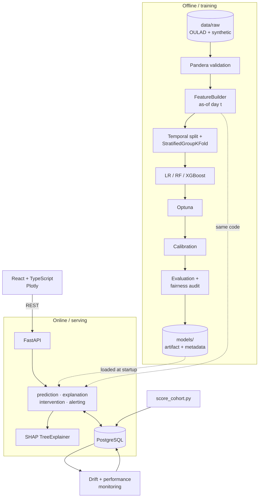

# Student Dropout Early-Warning & Intervention System

An ML system that estimates, at fixed checkpoints through a course, the
probability that a student withdraws within the next 30 days — together with the
factors that drove each estimate and the support actions they suggest.

> **Status: Phase 1 of 14 complete** (research, requirements, and scaffolding).
> No model has been trained yet, and **no performance claims appear anywhere in
> this repository** until Phase 6. See [Project phases](#project-phases).

---

## What this predicts (and what it does not)

The authoritative definition is [docs/TASK_SPEC.md](docs/TASK_SPEC.md):

> Given only the information available about a student as of course-relative day
> `t`, estimate the probability that the student withdraws within the following
> 30 days.

This is deliberately **not** "will this student ever drop out". The
point-in-time framing is what makes "early warning" a verifiable property of the
system rather than a marketing claim — the model demonstrably has no access to
data from after the moment it predicts.

It does **not** predict degree completion, academic ability, or anything about a
student's worth or effort. It must never be used for admissions, funding, or
disciplinary decisions. See [docs/ETHICS.md](docs/ETHICS.md).

## Why this is not another dropout-prediction notebook

Most public projects on this problem compute features from a student's complete
record, label by final outcome, split randomly, and report accuracy in the 90s.
That number is an artefact of leakage, not a result.

This project differs in ways that can be checked rather than claimed:

| | Typical approach | This project |
|---|---|---|
| Framing | One row per student, final outcome | One row per (student, checkpoint), 30-day horizon |
| Features | Computed from the whole record | Strictly `timestamp <= t`, enforced by a property test |
| Split | `train_test_split(random_state=42)` | Forward-in-time by cohort + `StratifiedGroupKFold` on student |
| Headline metric | Accuracy | PR-AUC, with recall-targeted operating point |
| Probabilities | Raw model output | Isotonic-calibrated, Brier score reported |
| Imbalance | SMOTE, unexamined | Class weights + threshold tuning; SMOTE tested and argued |
| Thresholds | Hardcoded constants | Config, calibrated against support capacity, flagged uncalibrated until then |
| Explanations | SHAP plot in a notebook | Per-prediction, non-causal language enforced by CI |
| Output | A label | Risk trajectory, alerts, and supportive interventions requiring human sign-off |

Expect the reported metrics to be **lower** than those public notebooks. That is
the point.

## Architecture



Two decisions carry most of the weight:

- **One `FeatureBuilder`, imported by both training and the API.** Reimplementing
  feature logic in the backend is the classic cause of train/serve skew, and it
  fails silently. A test asserts both paths produce identical vectors.
- **Predictions are persisted, not computed on page load.** A batch scorer writes
  per-checkpoint predictions, so risk *trajectory* is real retained history and
  dashboard reads stay fast.

Full rationale: [docs/adr/](docs/adr/).

## Stack

**ML** Python 3.10 · scikit-learn · XGBoost · imbalanced-learn · SHAP · Optuna · pandas · DuckDB
**Validation** Pandera (frames) · Pydantic v2 (API)
**Backend** FastAPI · SQLAlchemy 2.0 async · Alembic · PostgreSQL 16
**Frontend** React 18 · TypeScript · Vite · TanStack Query · Plotly.js · Tailwind
**Ops** Docker Compose · GitHub Actions · pytest · ruff · mypy

Python 3.10 is pinned deliberately: SHAP and XGBoost wheel availability on 3.13+
is unreliable ([ADR-0004](docs/adr/0004-architecture-and-stack.md)).

## Data

Two tracks, with provenance recorded on every row
([ADR-0002](docs/adr/0002-dataset-strategy.md), [docs/DATA_CARD.md](docs/DATA_CARD.md)):

- **OULAD** (real, CC-BY 4.0) — daily VLE clickstream, timestamped assessments,
  real withdrawal dates across time-ordered cohorts. **All headline metrics come
  from here.**
- **Synthetic cohort** (generated from a published causal DAG) — supplies the
  GPA / backlog / attendance dimensions OULAD lacks, so those are never
  fabricated onto real students.

Synthetic metrics are reported in a separate table under a fixed caveat: they
measure pipeline correctness, not real-world predictive performance.

## Installation

Requires Python 3.10 and Git.

```bash
git clone <repo-url> && cd student-dropout-ews

# Windows (PowerShell)
py -3.10 -m venv .venv
.\.venv\Scripts\python.exe -m pip install -e ".[dev,viz]"

# macOS / Linux
python3.10 -m venv .venv && source .venv/bin/activate
pip install -e ".[dev,viz]"

cp .env.example .env
```

With `make` available (Git Bash on Windows): `make setup`.

## Verify the setup

```bash
.venv/Scripts/python -m pytest -q     # 31 tests
.venv/Scripts/ruff check .
.venv/Scripts/mypy
```

Or `make check`.

## Project phases

| Phase | Scope | Status |
|---|---|---|
| 1 | Research, requirements, ADRs, scaffolding | **Complete** |
| 2 | Data acquisition, validation, checkpoint construction, synthetic generator | Next |
| 3 | EDA — including the horizon decision from ADR-0001 | |
| 4 | Longitudinal feature engineering + the as-of property test | |
| 5 | Baselines (LR, RF) and the evaluation harness | |
| 6 | XGBoost tuning, imbalance experiments, calibration, band calibration | |
| 7 | SHAP explainability + intervention rule engine | |
| 8 | FastAPI backend | |
| 9 | PostgreSQL schema, migrations, batch scorer | |
| 10 | React dashboard | |
| 11 | Integration, Docker Compose, drift monitoring | |
| 12 | Test coverage, fairness audit | |
| 13 | Deployment (free tiers) | |
| 14 | Documentation and model card | |

## Repository layout

```
src/dropout_ews/        installable package — imported by training AND the API
  config/               features.yaml, thresholds.yaml, typed settings
  data/ preprocessing/ features/ models/ evaluation/
  explainability/ interventions/ monitoring/ pipeline/
backend/app/            FastAPI application (Phase 8)
frontend/               React dashboard (Phase 10)
tests/{unit,ml,api,integration}/
docs/                   TASK_SPEC · DATA_CARD · ETHICS · adr/
notebooks/ scripts/ data/ models/ reports/
```

## Limitations

Stated up front rather than buried:

- OULAD is one UK distance-learning institution, 2013–2014. Findings do not
  transfer to a residential university without re-validation.
- The label is administrative de-registration, which under-counts students who
  disengage without formally withdrawing — likely not at random across groups.
- The test set is a single cohort, so confidence intervals will be wide. All
  metrics are reported with bootstrap CIs, never as bare point estimates.
- Engagement features partly measure a student's circumstances (connectivity,
  work and caring commitments) rather than their risk.
- Risk-band cutoffs are an institutional policy choice about support capacity,
  not a validated scale.
- SHAP attributions describe model behaviour, not causes of dropout.

## Ethics

Data minimization (no protected attributes in the feature path), role-based
access, audit logging of every individual-record read, supportive-only
interventions, and mandatory human review before any action — with the last two
enforced by config validators and tests rather than policy alone.
See [docs/ETHICS.md](docs/ETHICS.md).

## License

MIT. OULAD is CC-BY 4.0 and is not redistributed here.
